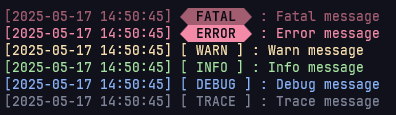
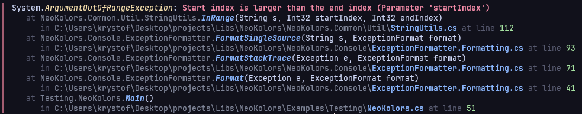
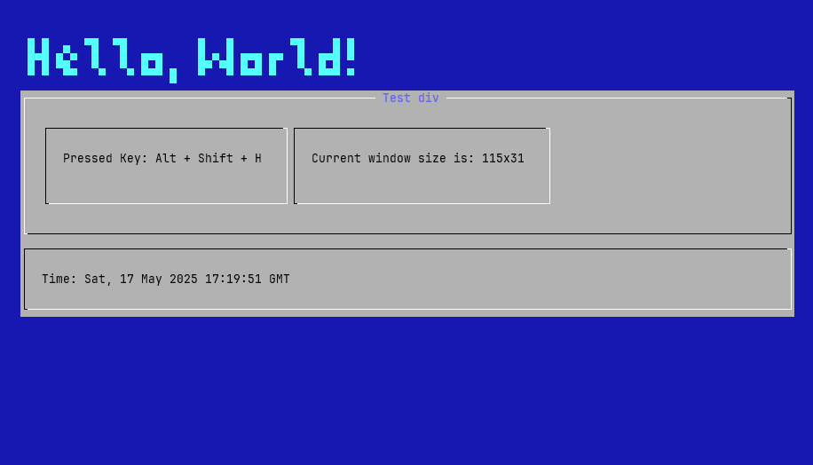

<div align="center">

<h1>NeoKolors</h1>

[](https://github.com/KryKomDev/NeoKolors/blob/main/LICENSE)
[](https://img.shields.io/github/v/release/KryKomDev/NeoKolors?sort=semver&style=for-the-badge&label=Latest%20Stable&labelColor=2a313c&color=e051c6)
[](https://img.shields.io/github/v/release/KryKomDev/NeoKolors?include_prereleases&sort=semver&style=for-the-badge&label=Latest&labelColor=2a313c&color=e051c6)
[](https://img.shields.io/github/commit-activity/m/KryKomDev/NeoKolors/main?style=for-the-badge&labelColor=%232a313c&color=%2358a6ff)

</div>

## About

NeoKolors is a C# library ecosystem with a number of color utilities, console graphics 
classes, and a modern, web-inspired Text User Interface (TUI) framework.

---

## Build status

### Projects

| Project name     | Build status  | Test status |
|:-----------------|:--------------|:------------|
| Common           | [](https://github.com/KryKomDev/NeoKolors/actions/workflows/build.yml) | [](https://github.com/KryKomDev/NeoKolors/actions/workflows/build.yml) |
| Console          | [](https://github.com/KryKomDev/NeoKolors/actions/workflows/build.yml) | [](https://github.com/KryKomDev/NeoKolors/actions/workflows/build.yml) |
| Extensions       | [](https://github.com/KryKomDev/NeoKolors/actions/workflows/build.yml) | [](https://github.com/KryKomDev/NeoKolors/actions/workflows/build.yml) |
| Tui              | [](https://github.com/KryKomDev/NeoKolors/actions/workflows/build.yml) | [](https://github.com/KryKomDev/NeoKolors/actions/workflows/build.yml) |
| Tui.Core         | [](https://github.com/KryKomDev/NeoKolors/actions/workflows/build.yml) | [](https://github.com/KryKomDev/NeoKolors/actions/workflows/build.yml) |
| Tui.Fonts        | [](https://github.com/KryKomDev/NeoKolors/actions/workflows/build.yml) | [](https://github.com/KryKomDev/NeoKolors/actions/workflows/build.yml) |
| Tui.Fonts.Assets | [](https://github.com/KryKomDev/NeoKolors/actions/workflows/build.yml) | [](https://github.com/KryKomDev/NeoKolors/actions/workflows/build.yml) |
| Tui.Generators   | [](https://github.com/KryKomDev/NeoKolors/actions/workflows/build.yml) | [](https://github.com/KryKomDev/NeoKolors/actions/workflows/build.yml) |

### Tools

| Tool name | Build status                                                                                                                                                                                                                                                                   | Test status                                                                                                                                                                                                                                                                  |
|:----------|:-------------------------------------------------------------------------------------------------------------------------------------------------------------------------------------------------------------------------------------------------------------------------------|:-----------------------------------------------------------------------------------------------------------------------------------------------------------------------------------------------------------------------------------------------------------------------------|
| NKFont    | [](https://github.com/KryKomDev/NeoKolors/actions/workflows/build.yml)  | [](https://github.com/KryKomDev/NeoKolors/actions/workflows/build.yml)  |
| NKChess   | [](https://github.com/KryKomDev/NeoKolors/actions/workflows/build.yml) | [](https://github.com/KryKomDev/NeoKolors/actions/workflows/build.yml) |

### Docs

[](https://img.shields.io/github/actions/workflow/status/KryKomDev/NeoKolors/deploy-docs.yml?style=for-the-badge&labelColor=2a313c)

---

## NeoKolors.Common

[](https://www.nuget.org/packages/NeoKolors.Common) 
[](https://www.nuget.org/packages/NeoKolors.Common) 

NeoKolors.Common contains basic common tools, structures, and classes for working 
with colors and ANSI escape sequences. It also offers some other helpful utilities, 
optimized primitives, and Sixel graphics support.

---

## NeoKolors.Extensions

[](https://www.nuget.org/packages/NeoKolors.Extensions) 
[](https://www.nuget.org/packages/NeoKolors.Extensions) 

NeoKolors.Extensions is a high-performance productivity library providing utility 
extensions for standard .NET and C# types. It includes word wrapping (`Chop`), plain 
text visual length calculators, collection helpers, and programmable name casing 
transformations (`NamingCase`).

---

## NeoKolors.Console

[](https://www.nuget.org/packages/NeoKolors.Console) 
[](https://www.nuget.org/packages/NeoKolors.Console) 

NeoKolors.Console offers a fully configurable logger with the option of coloring the 
messages when printing to console. It also offers automatic unhandled exception formatting. 
One of the most basic features is output text styling.

### Logs


### Exceptions


---

## NeoKolors.Settings

[](https://www.nuget.org/packages/NeoKolors.Settings) 
[](https://www.nuget.org/packages/NeoKolors.Settings) 

NeoKolors.Settings is a framework for transferring configurations and automation of 
instance-from-settings creation. It offers a simple syntax to create solid settings 
configuration options.

```c# 
var builder = SettingsBuilder<Result>.Build("c-builder",
    SettingsNode<Result>.New("default")
        .Argument("field", Arguments.Integer(-10, 10))
        .Constructs(context => new Result((int)context["field"].Get()))
);

var result = builder.GetResult();
```

---

## NeoKolors.Tui

[](https://www.nuget.org/packages/NeoKolors.Tui) 
[](https://www.nuget.org/packages/NeoKolors.Tui) 

NeoKolors.Tui is a framework for creating highly customizable TUI's in console emulators. 
It is made to be as similar as possible to web development.

Picture below is an example of a Ncurses-style like Tui application.



### Presentations

NeoKolors.Tui framework can also be used to create interactive presentations loaded from 
Markdown files. This feature is, however, still in the works.

> [!IMPORTANT]
> NeoKolors.Tui is still in early development. It can be unstable or have unexpected behavior. 
> Use at your own risk.

---

## NeoKolors.Tui.Fonts

[](https://www.nuget.org/packages/NeoKolors.Tui.Fonts) 
[](https://www.nuget.org/packages/NeoKolors.Tui.Fonts) 

NeoKolors.Tui.Fonts is the core font engine for the NeoKolors TUI framework. It provides 
parsing, serializing, measuring, and rendering capabilities for stylized ASCII and ANSI fonts.

---

## NeoKolors.Tui.Fonts.Assets

[](https://www.nuget.org/packages/NeoKolors.Tui.Fonts.Assets) 
[](https://www.nuget.org/packages/NeoKolors.Tui.Fonts.Assets) 

NeoKolors.Tui.Fonts.Assets contains the default built-in fonts (`Bytesized`, 
`Future`, and `Dummy`) and the MSBuild compilation pipeline task to package 
them as embedded resources.

---

## NeoKolors.Tools.NKFont

[](https://www.nuget.org/packages/NeoKolors.Tools.NKFont) 
[](https://www.nuget.org/packages/NeoKolors.Tools.NKFont) 

NKFontTool (`nkfont`) is a command-line interface (CLI) tool designed to manage, 
compile, display, inspect, and create custom TUI fonts for the NeoKolors framework.

---

## Installation

To use one of NeoKolors' packages, add a reference to the project in your solution. 
You can use one of the following methods:

### NuGet CLI

```bash {{ copy = true }}
Install-Package NeoKolors.Common
Install-Package NeoKolors.Extensions
Install-Package NeoKolors.Console
Install-Package NeoKolors.Tui
Install-Package NeoKolors.Tui.Fonts
Install-Package NeoKolors.Tui.Fonts.Assets
```

### .NET CLI

```bash
dotnet add package NeoKolors.Common
dotnet add package NeoKolors.Extensions
dotnet add package NeoKolors.Console
dotnet add package NeoKolors.Tui
dotnet add package NeoKolors.Tui.Fonts
dotnet add package NeoKolors.Tui.Fonts.Assets
```

### Installing the NKFont CLI Tool

```bash
dotnet tool install --global NeoKolors.Tools.NKFont
```

### Manual Reference

Or, manually reference in a project using `<PackageReference>` in your `.csproj` file:

```xml
<ItemGroup>
    <!-- ... -->
    <!-- change the version when a newer one is available -->
    <PackageReference Include="NeoKolors.Common" Version="*"/>
    <PackageReference Include="NeoKolors.Extensions" Version="*"/>
    <PackageReference Include="NeoKolors.Console" Version="*"/>
    <PackageReference Include="NeoKolors.Tui" Version="*"/>
    <PackageReference Include="NeoKolors.Tui.Fonts" Version="*"/>
    <PackageReference Include="NeoKolors.Tui.Fonts.Assets" Version="*"/>
    <!-- ... -->
</ItemGroup>
```

> [!NOTE]
> You do not need to copy all the lines. Select only the packages you want to import.