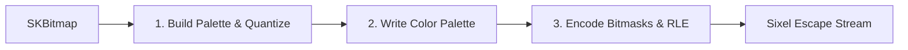

# Sixel Graphics Rendering

**[SixelConverter](file:///C:/Users/krystof/Desktop/projects/Libs/NeoKolors/Src/Common/SixelConverter.cs)** provides high-performance utility methods to serialize raster images (using **SkiaSharp** bitmaps) into Sixel graphic streams. This allows drawing premium high-fidelity graphics, charts, or diagrams directly inside compatible terminals.

---

## 1. What is Sixel Graphics?

Sixel (short for "six pixels") is a legacy terminal graphics format that has experienced a modern resurgence. It represents images as a sequence of vertical blocks that are 6 pixels high by 1 pixel wide. Each block is represented by a single ASCII character, whose value is offset by 63 (so the characters range from `?` to `~`).

### Sixel Data Frame
A Sixel string consists of:
1. **Introduction Sequence**: `\eP0;1;q` (starts Sixel encoding).
2. **Raster Attributes**: Defines the target width and height constraints.
3. **Color Palette Mapping**: Maps RGB percentages to palette slot indices.
4. **Data Bands**: Vertical bands of 6-pixel rows containing characters encoding the pixel masks.
5. **Termination Sequence**: `\e\\` (ends Sixel encoding and returns terminal control).

---

## 2. Encoder Architecture and Pipeline

The `SixelConverter.ToSixel` method runs the image through a 3-step compilation pipeline:



### 2.1 Quantization & Color Palette Building
Sixel images are limited to a maximum of 256 colors.
- **Perfect Palette**: If the source `SKBitmap` contains fewer than 256 unique colors, `SixelConverter` maps them exactly to avoid any color loss.
- **3-3-2 Quantization**: If the image contains more than 256 colors, it falls back to a 3-3-2 bit RGB quantization grid to approximate colors while staying within the 256 palette limit.
- **Alpha Masking**: An `alphaThreshold` parameter (0–255, default 128) determines if a pixel is rendered as transparent or opaque.

### 2.2 Band-Based Bitmask Encoding
The image is split vertically into bands of 6 pixels:
- For each band, the encoder identifies which colors are present.
- For each present color, a bitmask is constructed for each column.
- The 6 vertical pixels correspond to bits 0 through 5 in the bitmask. If a pixel matches the current color, the corresponding bit is set.
- The bitmask is converted to a character: `char c = (char)(63 + bitmask)`.

### 2.3 Run-Length Encoding (RLE) Optimization
To reduce output size, the encoder matches consecutive columns of the same character and compresses them using the Sixel repeat command syntax:
- Syntax: `!{count}{character}`
- E.g. `!24?` replaces 24 consecutive `?` characters, saving valuable bandwidth and increasing terminal rendering speeds.

---

## 3. Example: Displaying an Image in C#

Below is an example showing how to load a raster image using SkiaSharp, convert it to Sixel format, and write it to the terminal:

```csharp
using System;
using SkiaSharp;
using NeoKolors.Common;

public static class ImagePresenter 
{
    public static void DrawImage(string filePath) 
    {
        // 1. Load the image into a SkiaSharp bitmap
        using (var codec = SKCodec.Create(filePath))
        using (var bitmap = SKBitmap.Decode(codec)) 
        {
            // 2. Convert the bitmap to Sixel escape sequence
            string sixelData = bitmap.ToSixel(alphaThreshold: 128);

            // 3. Write directly to the console stream
            Console.Write(sixelData);
            Console.WriteLine();
        }
    }
}
```

---

## 4. Supported Terminal Clients

To render Sixel images properly, developers must use a terminal emulator that supports the Sixel protocol:
* **Windows Terminal** (Ensure Sixel support is enabled in Settings)
* **WezTerm**
* **Alacritty** (with Sixel patches)
* **xterm**
* **iTerm2**
