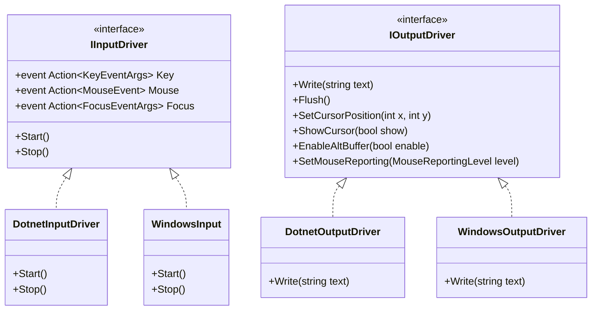

# NeoKolors Console Architecture and Drivers

The `NeoKolors.Console` project is the low-level foundation for the NeoKolors ecosystem. It acts as the driver layer that abstracts terminal inputs/outputs and provides diagnostics, structured logging, and pretty exception formatting.

---

## 1. Driver Architecture

To achieve cross-platform terminal control (including Windows Console API and Virtual Terminal/ANSI sequences), the library abstracts input and output through interfaces:



### 1.1 Input Drivers
* **[IInputDriver](file:///C:/Users/krystof/Desktop/projects/Libs/NeoKolors/Src/Console/Driver/IInputDriver.cs)**: Declares events for key presses, mouse clicks/movements, and focus changes.
* **[DotnetInputDriver](file:///C:/Users/krystof/Desktop/projects/Libs/NeoKolors/Src/Console/Driver/Dotnet/DotnetInputDriver.cs)**: Standard C# input driver that polls `System.Console.ReadKey` and parses incoming ANSI escape sequences.
* **[WindowsInput](file:///C:/Users/krystof/Desktop/projects/Libs/NeoKolors/Src/Console/Driver/Windows/WindowsInput.cs)**: Low-level Windows Console API hook (`ReadConsoleInputW`) for high-fidelity mouse/keyboard reporting on legacy Windows command prompts.

### 1.2 Output Drivers
* **[IOutputDriver](file:///C:/Users/krystof/Desktop/projects/Libs/NeoKolors/Src/Console/Driver/IOutputDriver.cs)**: Declares primitives to write to the terminal, move cursors, toggles screen buffers, and configures mouse tracking.
* **[DotnetOutputDriver](file:///C:/Users/krystof/Desktop/projects/Libs/NeoKolors/Src/Console/Driver/Dotnet/DotnetOutputDriver.cs)**: Standard ANSI escape-sequence based terminal writer.
* **[WindowsOutputDriver](file:///C:/Users/krystof/Desktop/projects/Libs/NeoKolors/Src/Console/Driver/Windows/WindowsOutputDriver.cs)**: Uses `SetConsoleMode` and native Win32 output buffers.

---

## 2. Interactive Console Operations (`NKConsole`)

The static class **[NKConsole](file:///C:/Users/krystof/Desktop/projects/Libs/NeoKolors/Src/Console/NKConsole.Out.cs)** serves as the developer-facing entry point. It wraps output operations, buffer toggling, and input hooks.

### 2.1 Virtual Terminal Mode Toggles

```csharp
using NeoKolors.Console;

// Enter Alt Screen Buffer (protects user's shell history)
NKConsole.EnableAltBuffer();

// Disable Alt Screen Buffer upon exit
NKConsole.DisableAltBuffer();

// Hide hardware blinking cursor for smoother TUI rendering
NKConsole.HideCursor();
```

### 2.2 Advanced Input Event Subscription
Instead of polling `Console.ReadKey`, subscribe to clean events:

```csharp
using NeoKolors.Console;
using NeoKolors.Console.Input;

NKConsole.KeyDown += (KeyEventArgs e) => {
    if (e.Key == KeyCode.Escape) {
        NKConsole.WriteLine("Exiting application...");
    }
};

NKConsole.Mouse += (MouseEvent e) => {
    NKConsole.SetCursorPosition(e.Position.X, e.Position.Y);
    NKConsole.Write("X");
};
```
