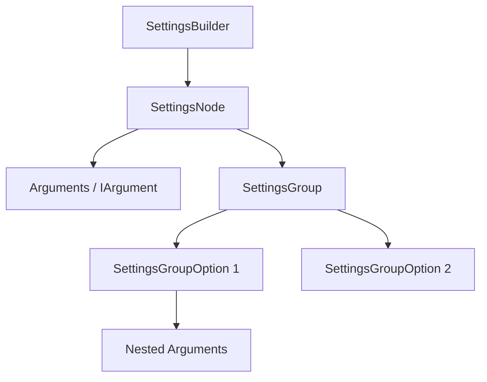

# NeoKolors Settings Overview

The `NeoKolors.Settings` package is a typed configuration building and parsing system. It allows developers to define command-line or interactive configuration structures, validate inputs, group mutual options, and construct final application/service settings objects.

---

## 1. Architectural Model

The settings schema is represented as a tree of nodes and arguments:



### 1.1 Core Components

* **[SettingsBuilder\<T\>](file:///C:/Users/krystof/Desktop/projects/Libs/NeoKolors/Src/Settings/Builder/ISettingsBuilder.cs)**: The main entry point to parse, validate, and retrieve the constructed instance of type `T`.
* **[SettingsNode\<T\>](file:///C:/Users/krystof/Desktop/projects/Libs/NeoKolors/Src/Settings/Builder/SettingsNode.cs)**: Represents a distinct configuration node. It holds arguments and groups, and defines a constructor delegate to produce a result.
* **[Context](file:///C:/Users/krystof/Desktop/projects/Libs/NeoKolors/Src/Settings/Context.cs)**: A dictionary-like structure holding parsed argument values and sub-contexts. Used during construction.
* **[IArgument](file:///C:/Users/krystof/Desktop/projects/Libs/NeoKolors/Src/Settings/Argument/IArgument.cs)**: Interface implemented by all typed parameters (e.g. `IntegerArgument`, `StringArgument`). Handles parsing and validation.

---

## 2. Defining Arguments

Arguments are created using factory methods in the static class **[Arguments](file:///C:/Users/krystof/Desktop/projects/Libs/NeoKolors/Src/Settings/Arguments.cs)**:

```csharp
using NeoKolors.Settings;

// Integer between 0 and 100
var integerArg = Arguments.Integer(min: 0, max: 100);

// Required string matching a pattern or length
var stringArg = Arguments.String();

// Single selection out of predefined values
var selectionArg = Arguments.SingleSelect("OptionA", "OptionB", "OptionC");
```

---

## 3. Creating a Settings Builder

Below is an example of creating a builder to configure and instantiate a custom class `ServerConfig`:

```csharp
using NeoKolors.Settings;

public class ServerConfig {
    public string Host { get; }
    public int Port { get; }
    
    public ServerConfig(string host, int port) {
        Host = host;
        Port = port;
    }
}

// Defining the settings structure
var builder = SettingsBuilder<ServerConfig>.Build("server-settings",
    SettingsNode<ServerConfig>.New("default")
        .Argument("host", Arguments.String())
        .Argument("port", Arguments.Integer(1024, 65535))
        .Constructs(context => new ServerConfig(
            (string)context["host"].Get(),
            (int)context["port"].Get()
        ))
);

// Retrieve the constructed result after parsing
ServerConfig config = builder.GetResult();
```

---

## 4. Conditional Settings Groups

Use `SettingsGroup` to support different configuration paths (like setting password credentials vs. SSH keys):

```csharp
var authGroup = SettingsGroup.New("auth")
    .Option(SettingsGroupOption.New("password")
        .Argument("pass", Arguments.String())
        .Merges((cin, cout) => cout["secret"] <<= cin["pass"].Get())
    )
    .Option(SettingsGroupOption.New("sshkey")
        .Argument("keypath", Arguments.Path())
        .Merges((cin, cout) => cout["secret"] <<= cin["keypath"].Get())
    );
```
