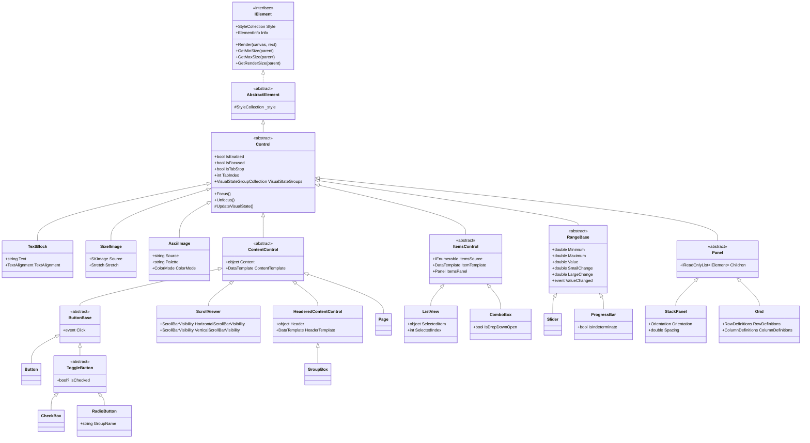

# NeoKolors TUI Type Hierarchy (UWP-Inspired)

This document outlines a modern, desktop-grade UWP/WPF-inspired type hierarchy
designed to fully replace the HTML-like elements in the NeoKolors TUI framework. 

By transitioning from HTML-style nodes (Div, Body, Text, etc.) to a stateful,
template-driven desktop hierarchy (Panel, Page, TextBlock, etc.), NeoKolors
achieves superior control encapsulation, integrated Visual States, structured
routed events, and standard star-sizing layout systems.

---

## 1 The Replacement Map

The following table summarizes how the existing HTML-like elements are
deprecated and replaced by the new UWP-style controls:

| HTML-like Element (Legacy)           | UWP Replacement (New Hierarchy)                | Primary Architectural Enhancements                                                                                                                                                     |
|:-------------------------------------|:-----------------------------------------------|:---------------------------------------------------------------------------------------------------------------------------------------------------------------------------------------|
| **Body**                             | **Page** (or **Window**)                       | Represents a complete application screen or viewport. Built-in support for page history navigation (when hosted inside a Frame) and focus boundaries.                                  |
| **Div**                              | **Grid**, **StackPanel**, or **RelativePanel** | Replaces generic flex containers with explicit, high-performance layout panels. Supports star (`*`) sizing, column/row definitions, and sibling positioning coordinates.               |
| **NamedDiv**                         | **GroupBox**                                   | A control that combines a border frame, a distinct visual boundary, and a structured Header block (inheriting from HeaderedContentControl).                                            |
| **Text**, **Paragraph**, **Heading** | **TextBlock**                                  | Consolidates all text rendering. Decouples margins/paddings into the control layout, introducing rich horizontal/vertical alignments and wrap configurations.                          |
| **Button**                           | **Button**                                     | Elevates buttons from simple text blocks to generic ContentControl hosts. Can host arbitrary layouts (e.g. text, icons, grids) and responds to visual states.                          |
| **Image**                            | **SixelImage** or **AsciiImage**               | Replaced by two specialized controls: `SixelImage` renders high-fidelity vector/bitmap pixel grids using SkiaSharp, while `AsciiImage` displays lightweight retro text-shading arrays. |
| **List**                             | **ListView** or **ListBox**                    | Replaces static list rendering with dynamic ItemsControl bindings (ItemsSource), supporting item templates, scrollbars, and select events.                                             |
| **TextInput**                        | **TextBox**                                    | Upgrades simple input lines to a full, focusable, state-driven edit control with keyboard selection and input validation.                                                              |

---

## 2 Visual Inheritance Hierarchy

The diagram below maps out the complete, unified UWP replacement hierarchy for the
NeoKolors TUI framework:



---

## 3 Conceptual & Architectural Pillars

The replacement design moves away from the static, CSS-like properties of
the HTML DOM and introduces core desktop layout patterns:

### 3.1 The Visual State Manager (VSM)

Control visuals transition automatically based on interaction states,
eliminating ad-hoc style updates:
* **State Groups**:
  * **CommonStates**: Normal, PointerOver (Hover), Pressed, Disabled
  * **FocusStates**: Focused, Unfocused
  * **SelectionStates**: Unselected, Selected
* **Visual States**: Defined in styling metadata. When a state changes (e.g.,
  cursor hovers over a Button), the control applies the associated property
  diffs (e.g. background color, border highlight).

### 3.2 Dependency & Attached Properties

Replaces CSS nesting selectors. Containers attach coordinate properties
directly to their immediate child controls:
* **Grid Controls**: Grid.Row, Grid.Column, Grid.RowSpan, Grid.ColumnSpan.
* **Canvas Controls**: Canvas.Left, Canvas.Top.
* **Relative Panel Controls**: RelativePanel.RightOf, RelativePanel.Below.
* **Implementation**: Stored dynamically within each element's extensible
  StyleCollection to decouple layout rules from control definitions.

### 3.3 Routed Events System

Propagates console interactions smoothly through the UI layout hierarchy:
* **Tunneling (Preview)**: Standard input travels down from the root container
  (Page) to the source element, giving parent containers intercept
  opportunities (e.g., PreviewKeyDown).
* **Bubbling**: Once evaluated by the targeted element, events travel upwards
  to parent containers (e.g., mouse clicks, key actions).

---

## 4 The New Type Hierarchy Spec

The following specifications detail the core classes that construct the
new UWP type hierarchy.

### 4.1 Base Framework Types

#### 4.1.1 Control
The fundamental element for all interactive controls, containing unified hooks
for state, focus, and input.

```csharp
namespace NeoKolors.Tui.Elements;

public abstract class Control<T> : AbstractElement<T> {
    public bool IsEnabled { get; set; } = true;
    public bool IsFocused { get; protected set; }
    public bool IsTabStop { get; set; } = true;
    public int TabIndex { get; set; }

    public VisualStateGroupCollection VisualStateGroups { get; } = new();

    public event Action<Control<T>>? GotFocus;
    public event Action<Control<T>>? LostFocus;
    public event Action<Control<T>, bool>? IsEnabledChanged;

    protected Control(StyleCollection defaultStyle) : base(defaultStyle) { }
    protected Control() : base() { }

    public virtual void Focus() {
        if (!IsEnabled || !IsTabStop || IsFocused) return;
        IsFocused = true;
        UpdateVisualState();
        GotFocus?.Invoke(this);
    }

    public virtual void Unfocus() {
        if (!IsFocused) return;
        IsFocused = false;
        UpdateVisualState();
        LostFocus?.Invoke(this);
    }

    protected virtual void UpdateVisualState() {
        // Automatically updates styles matching active interaction states
    }
}
```

#### 4.1.2 ContentControl

The base class for controls containing a single piece of content (string,
custom model, or another IElement).

```csharp
public abstract class ContentControl : Control<IElement> {
    private object? _content;
    
    public object? Content {
        get => _content;
        set {
            if (_content == value) return;
            var old = _content;
            _content = value;
            OnContentChanged(old, value);
        }
    }

    public DataTemplate? ContentTemplate { get; set; }

    public event Action<ContentControl, object?, object?>? ContentChanged;

    protected virtual void OnContentChanged(object? oldContent, object? newContent) {
        ContentChanged?.Invoke(this, oldContent, newContent);
    }
}
```

#### 4.1.3 ItemsControl

The foundation for items presentation. Decouples items (ItemsSource) from
visual containers using templates and layouts.

```csharp
public abstract class ItemsControl : Control<IElement[]> {
    private IEnumerable? _itemsSource;
    
    public IEnumerable? ItemsSource {
        get => _itemsSource;
        set {
            if (_itemsSource == value) return;
            _itemsSource = value;
            OnItemsSourceChanged();
        }
    }

    public DataTemplate? ItemTemplate { get; set; }
    public Panel ItemsPanel { get; set; } = new StackPanel();

    public event Action<ItemsControl>? ItemsSourceChanged;

    protected virtual void OnItemsSourceChanged() {
        ItemsSourceChanged?.Invoke(this);
    }
}
```

#### 4.1.4 RangeBase

Supports selection within bounded numeric structures.

```csharp
public abstract class RangeBase : Control<double> {
    public double Minimum { get; set; } = 0.0;
    public double Maximum { get; set; } = 100.0;
    public double Value { get; set; } = 0.0;
    public double SmallChange { get; set; } = 1.0;
    public double LargeChange { get; set; } = 10.0;

    public event Action<RangeBase, double, double>? ValueChanged;

    protected virtual void OnValueChanged(double oldValue, double newValue) {
        ValueChanged?.Invoke(this, oldValue, newValue);
    }
}
```

#### 4.1.5 Panel

The container base for multi-child structural layouts.

```csharp
public abstract class Panel : Control<IElement[]> {
    protected readonly List<IElement> _children = new();
    public IReadOnlyList<IElement> Children => _children;

    public virtual void AddChild(IElement child) {
        _children.Add(child);
        child.OnElementUpdated += OnChildUpdated;
    }

    public virtual void RemoveChild(IElement child) {
        _children.Remove(child);
        child.OnElementUpdated -= OnChildUpdated;
    }

    protected void OnChildUpdated() => OnElementUpdated?.Invoke();
}
```

---

### 4.2 Concrete Replacement Controls

#### 4.2.1 Text & Image Controls

##### TextBlock

* **TextBlock** (inherits from Control): Fully supersedes Text, Paragraph,
  and Heading. Renders plain or ANSI text sequences, supporting horizontal/
  vertical text alignment, text wrapping, and explicit bounds.

##### SixelImage

* **SixelImage** (inherits from Control): Specifically designed to render
  pixel-perfect bitmap data to terminal buffers supporting Sixel hardware
  acceleration.
  * **Source Type**: `SkiaSharp.SKImage` (providing robust native image
    decoding and manipulation).
  * **Properties**: `Source` (SKImage), `Stretch` (None, Fill, Uniform,
    UniformToFill), `RenderQuality` (High, Medium, Low).
  * **TUI Rendering**: Queries direct color pixels from the `SKImage`
    structure, scales them using the desired interpolation filter to match
    character cells/pixels, and translates the bitmap into raw terminal
    Sixel byte streams via `canvas.PlaceSixel`.

##### AsciiImage

* **AsciiImage** (inherits from Control): Designed for retro, character-
  shading, or colored text-based representations (ASCII Art) on the
  standard terminal character grid.
  * **Source Type**: `string` (multiline pre-rendered ASCII files) or
    dynamic rasterization (taking an `SKImage` or `SKBitmap` and
    down-sampling it at runtime).
  * **Properties**: `Source` (string/SKImage), `Palette` (e.g.,
    `"@#*+-:. "`), `ColorMode` (Grayscale, ANSI 16-color, Full TrueColor).
  * **TUI Rendering**: Translates the image pixels or string layout directly
    onto the `ICharCanvas` grid, mapping color density to specific character
    weights in the selected `Palette`.

#### 4.2.2 Layout Panels (inheriting from Panel)

* **StackPanel**: Arranges child controls in a single line (Horizontal/
  Vertical) with customizable spacing between items.
* **Grid**: Tabular layout resolving rows and columns with fixed (`10px`),
  proportional (`2*`), and auto sizing. Sibling components are allocated
  to cells via Grid.Row/Grid.Column.
* **Canvas**: Absolute, coordinate-based positioning utilizing Canvas.Left
  and Canvas.Top.
* **RelativePanel**: Arranges items in relation to parent borders or
  neighboring elements (e.g., `Below="target"`).

#### 4.2.3 Content Controls (inheriting from ContentControl)

* **Page** (or **Window**): The ultimate root context container. Occupies
  the screen viewport and acts as the entry point for navigation.
* **GroupBox** (inherits from HeaderedContentControl): Supersedes NamedDiv.
  Draws a border outline around a single child control and features a styled
  header text at the top edge.
* **ScrollViewer**: Displays vertical/horizontal scroll tracks using block
  chars (`░` and `█`) around clipped overflow contents.
* **Button** (inherits from ButtonBase): Supersedes the text-only Button.
  Represents a generic content host triggering clicks.
* **CheckBox** (inherits from ToggleButton): Interactive true/false/
  indeterminate selector displaying `[ ]`, `[x]`, or `[■]`.
* **RadioButton** (inherits from ToggleButton): Mutually exclusive group
  options displaying `( )` or `(o)`.
* **ToggleSwitch**: Replaces binary text choices with a premium switch UI:
  `[ o-]` (Off) and `[-o ]` (On).
* **Expander**: Drawer control displaying a header line with a collapse/
  expand symbol (`▼`/`►`) and containing a drawer that can slide down
  or collapse.
* **ToolTip**: Absolute overlay floating context box rendered with high ZIndex.
* **Frame**: Manages view navigation history and handles switching Page content.

#### 4.2.4 Items Controls (inheriting from ItemsControl)

* **ListView** (or **ListBox**): Supersedes the legacy List. Supports
  dynamic bindings, scrollable views, and selected item tracking with
  a sidebar cursor indicator (`>`).
* **GridView**: Multi-item layouts wrapping elements horizontally/vertically.
* **ComboBox**: Collapsible dropdown trigger: `[ Option Selected   ▼ ]`.
* **TreeView** (inherits from Control): Stateful tree nodes drawn using
  standard connectors `├──`/`└──` and folder toggles `►`/`▼`.
* **MenuBar**: Top utility menu strip.

#### 4.2.5 Range Controls (inheriting from RangeBase)

* **Slider**: Sliding bar select element: `═══╡█╞══════════ 30%`.
* **ProgressBar**: Discrete determinate bar (`[████░░░░] 50%`) or
  indefinite bouncing segment marquee (`[  ███   ]`).

#### 4.2.6 Input Controls

* **TextBox** (inherits from Control): Supersedes TextInput. Focusable
  single-line interactive text box with cursor tracking and standard
  editing key bindings.
* **PasswordBox** (inherits from Control): Secured single-line input
  displaying mask characters (e.g. `•`).
* **RichEditBox** (inherits from Control): Comprehensive multi-line text
  input control with text wrapping and editing.

---

## 5 Layout Demonstration

A mock-up showcasing how the new UWP-style controls replace the HTML-style
controls to form a premium, interactive TUI console dashboard:

```
┌─ [Settings Application] ────────────────────────────────────────────────────────┐
│ [ File ] [ Edit ] [ Help ]                                                      │
├─────────────────────────────────────────────────────────────────────────────────┤
│ ┌─ Search ──────────────────────────────┐ ┌─ Main Controls ───────────────────┐ │
│ │ Type here to search...                │ │ [x] Enable Notifications          │ │
│ └───────────────────────────────────────┘ │ [ ] Enable Dark Mode              │ │
│                                           │                                   │ │
│ ┌─ Modules ─────────────────────────────┐ │ Toggle Theme Mode:                │ │
│ │ ► System Settings                     │ │ [ System Default o-]              │ │
│ │ ▼ User Accounts                       │ │                                   │ │
│ │   ├── Administrator                   │ │ Brightness level:                 │ │
│ │   └── Guest                           │ │ ═════════╡█╞════════════ 35%      │ │
│ │ ► Network & Security                  │ │                                   │ │
│ └───────────────────────────────────────┘ │ Processing System Updates:        │ │
│                                           │ [████████████░░░░░░░░░░] 60%      │ │
│                                           │                                   │ │
│ Selected Account: Administrator           │ [ Save Settings ]  [ Cancel ]     │ │
│                                           └───────────────────────────────────┘ │
└─────────────────────────────────────────────────────────────────────────────────┘
```
