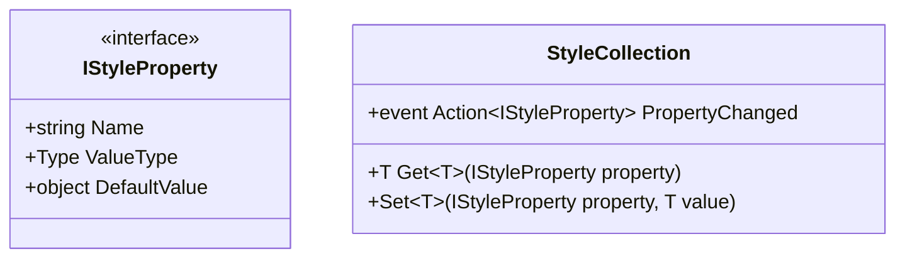

# TUI Styling System and Properties

The `NeoKolors.Tui` package implements a state-driven styling system modeled after modern desktop UI frameworks. It separates layout geometry, visual colors, and text properties into distinct, reactive property containers.

---

## 1. Style Properties Architecture

Unlike static CSS properties, style rules in NeoKolors are represented as typed property descriptors implementing **[IStyleProperty](file:///C:/Users/krystof/Desktop/projects/Libs/NeoKolors/Src/Tui/Styles/Properties/IStyleProperty.cs)**:



* **[StyleCollection](file:///C:/Users/krystof/Desktop/projects/Libs/NeoKolors/Src/Tui/Styles/StyleCollection.cs)**: Stored in every element, keeping track of assigned local style property values.
* **[IStyleProperty](file:///C:/Users/krystof/Desktop/projects/Libs/NeoKolors/Src/Tui/Styles/Properties/IStyleProperty.cs)**: Defines properties metadata (e.g. `BackgroundColorProperty`, `BorderProperty`, `MarginProperty`).

---

## 2. Setting Style Properties

Styles can be set directly on elements or configured as shared templates:

```csharp
using NeoKolors.Common;
using NeoKolors.Tui.Elements;
using NeoKolors.Tui.Styles.Properties;

var textBlock = new TextBlock();

// Assign text color
textBlock.Style.Set(TextColorProperty.Instance, NKColor.FromRgb(255, 128, 0));

// Assign margins (Left: 2 cells, Top: 1 cell, Right: 2 cells, Bottom: 1 cell)
textBlock.Style.Set(MarginProperty.Instance, new Thickness(2, 1, 2, 1));
```

---

## 3. Style Inheritance & Triggers

To support hover highlights and focused visual cues, properties resolve value changes using a priority hierarchy:

1. **Active State Triggers (Highest Priority)**: Values set by active visual states (e.g., cursor hover `PointerOver`, focus indicator `Focused`).
2. **Local Style Values**: Values explicitly set on the individual element's `StyleCollection` at runtime.
3. **Inherited Style Values**: Style properties designed to bubble down parent-child hierarchies (e.g. `FontProperty` or `TextColorProperty`).
4. **Default Property Values (Lowest Priority)**: Fallback values defined inside property declarations (e.g., transparent backgrounds, black text).

---

## 4. Visual State Managers

When interactive controls change state (e.g. `Button` is hovered or clicked), the control updates its state indicators. The style engine intercepts this update and applies state-specific property overrides defined in the element's style triggers:

```csharp
using NeoKolors.Tui.Styles;

// Configure normal state colors
button.Style.Set(BackgroundColorProperty.Instance, NKColor.FromRgb(50, 50, 50));

// Configure hover state trigger (PointerOver)
var hoverTrigger = new VisualStateTrigger("PointerOver");
hoverTrigger.Set(BackgroundColorProperty.Instance, NKColor.FromRgb(0, 180, 255));

button.VisualStateGroups.AddTrigger(hoverTrigger);
```
